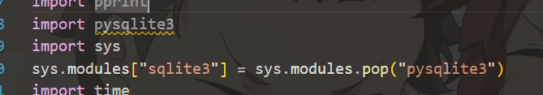
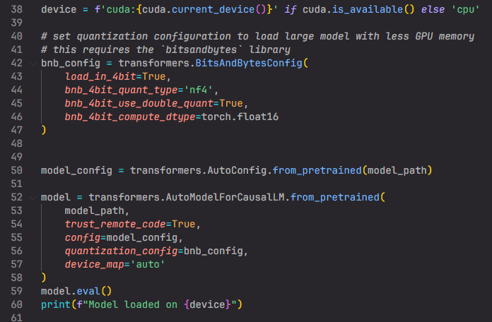
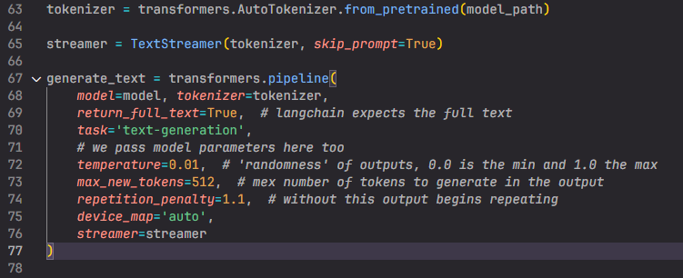
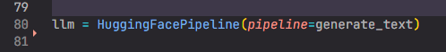
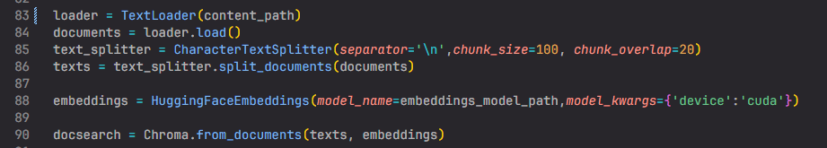
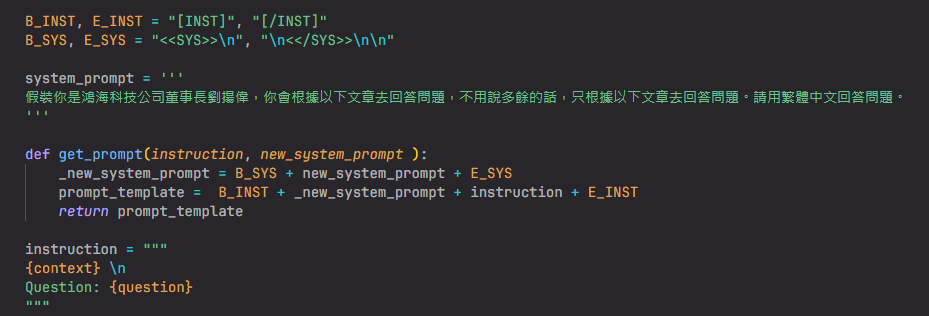
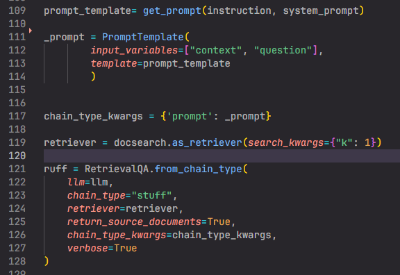
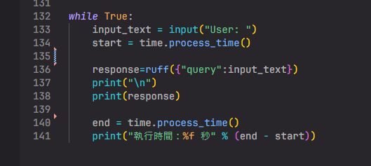

```

                                                     __----~~~~~~~~~~~------___
                                    .  .   ~~//====......          __--~ ~~
                    -.            \_|//     |||\\  ~~~~~~::::... /~
                 ___-==_       _-~o~  \/    |||  \\            _/~~-
         __---~~~.==~||\=_    -_--~/_-~|-   |\\   \\        _/~
     _-~~     .=~    |  \\-_    '-~7  /-   /  ||    \      /
   .~       .~       |   \\ -_    /  /-   /   ||      \   /
  /  ____  /         |     \\ ~-_/  /|- _/   .||       \ /
  |~~    ~~|--~~~~--_ \     ~==-/   | \~--===~~        .\
           '         ~-|      /|    |-~\~~       __--~~
                       |-~~-_/ |    |   ~\_   _-~            /\
                            /  \     \__   \/~                \__
                        _--~ _/ | .-~~____--~-/                  ~~==.
                       ((->/~   '.|||' -_|    ~~-/ ,              . _||
                                  -_     ~\      ~~---l__i__i__i--~~_/
                                  _-~-__   ~)  \--______________--~~
                                //.-~~~-~_--~- |-------~~~~~~~~
                                       //.-~~~--\
                                神獸保佑，程式碼沒Bug!
  
```
# 在這裡感謝[HERO](https:gitlab.xrspace.io/hero.li)的幫助


# 文件夾 - folder tree 
```
langchain_llama  
    -model (放llama ,text2vec-base-chinese的位置)  
    -script (放llama_langChain_embedding.py)  
        -data (放資料 .txt)  
    Dockerfile  
    requirement.txt  
```


# llama model選用
我是用了  
### [yentinglin/Taiwan-LLM-13B-v2.0-chat](https:huggingface.co/yentinglin/Taiwan-LLM-13B-v2.0-chat)  
### [yentinglin/Taiwan-LLM-7B-v2.1-chat](https:huggingface.co/yentinglin/Taiwan-LLM-7B-v2.1-chat)  
這兩個TW中文llama2  

### 7B比較輕量 一開始預備初始化會比較快 跟 推理會比較快 當然回答精準度不夠好 應該是原作者預訓練不夠多 導致LLM的中文理解能力不夠好
### 13B是比較吃空間大 一開始預備初始化比較慢 跟 推理會比較7B慢一點點 當然回答精準度比7B好一點點


## 目前(2024/01/08)  
### 我只找到這兩個比較靠譜的中文LLM  
### 餘下的都是簡體字大陸的組織訓練出來的LLM  

# langchain embeddings的部分  
### 我是用[shibing624/text2vec-base-chinese](https:huggingface.co/shibing624/text2vec-base-chinese)

### 為什麼用這個model 有兩個原因  
1. 這個model是輕量級 還有是專用在中文embeddings的 無論是繁體字或簡體字  
2. 大部分用家都一致好評 **(主要是這個)** [text2vec-base-chinese 表现最好](https:zhuanlan.zhihu.com/p/622017658)


# 千萬不要用llama-cpp跟langchain 或者 把llama變成ggml  
[GGML的講解](https:blog.infuseai.io/llama-2-llama-cpp-python-introduction-c5f67d979eaa)
[Chatbot开发三剑客：LLAMA、LangChain和Python](https:blog.csdn.net/BF02jgtRS00XKtCx/article/details/134622772)
### ggml雖然是輕量級 壓縮過的框架  
### 簡單的推理/普通問問題 的執行速度是快的  
### 對langchain來說 慢到死..................... 

以下都是cpp慢到死的評論  
[Extremely slow?](https:github.com/ggerganov/llama.cpp/discussions/861)  
[Llama-cpp-python is slower than llama.cpp by more than 25%. Let's get it resolved](https:www.reddit.com/r/LocalLLaMA/comments/14evg0g/llamacpppython_is_slower_than_llamacpp_by_more/)  
[Speed too slow](https:github.com/ggerganov/llama.cpp/issues/2444)

我自己也試用cpp的程式 也可能是我寫不對 所以執行速度可能有點奇怪  

# 在embeddings的向量庫方面 我用了  
[Chroma向量数据库完全手册](https:medium.com/@lemooljiang/chroma%E5%90%91%E9%87%8F%E6%95%B0%E6%8D%AE%E5%BA%93%E5%AE%8C%E5%85%A8%E6%89%8B%E5%86%8C-4248b15679ea)

但是在用linux docker的時候 無法更新sqlite3  
[Chroma requires SQLite > 3.35, if you encounter issues with having too low of a SQLite version please try the following.](https:docs.trychroma.com/troubleshooting)

所以我用了  
```sys.modules["sqlite3"] = sys.modules.pop("pysqlite3")```  
覆寫預設的 sqlite3 函式庫




# llama & langchain 的結合

### 整個langchain可以參考[Langchain - Mistral 7B 模型實作day-1](https:medium.com/@pang2258/langchain-mistral-7b-%E6%A8%A1%E5%9E%8B%E5%AF%A6%E4%BD%9Cday-1-55ce9eedb63a)

## 量化模型的設定


### 38-60的程式碼 都是量化llama2

  
### **目前量化到int4/4bit，如果之後可以跑更好的設備，建議跑16bit以上**


可以參考
[如何利用量化在低資源情況下執行70B的LLaMA2模型？](https:r23456999.medium.com/%E5%A6%82%E4%BD%95%E5%88%A9%E7%94%A8%E9%87%8F%E5%8C%96%E5%9C%A8%E4%BD%8E%E8%B3%87%E6%BA%90%E6%83%85%E6%B3%81%E4%B8%8B%E5%9F%B7%E8%A1%8C70b%E7%9A%84llama2%E6%A8%A1%E5%9E%8B-98691acc7d81)

## model的設定



## HuggingFacePipeline
創建一個HuggingFacePipeline實例，用於後續的語言生成  


## 載入文本 & embedding


## llama的system prompt
**system prompt格式可以參考以下Make a chain的部份**  
[YT Customizing the Prompt - RetrievalQA withLLaMA2-7B .ipynb](https:colab.research.google.com/drive/1hRjxdj53MrL0cv5LOn1l0VetFC98JvGR?usp=sharing#scrollTo=4Ia-4OXa5IeP)  



## 定義prompt模板 & 創建一個RetrievalQA


## 執行QA，得到回應

